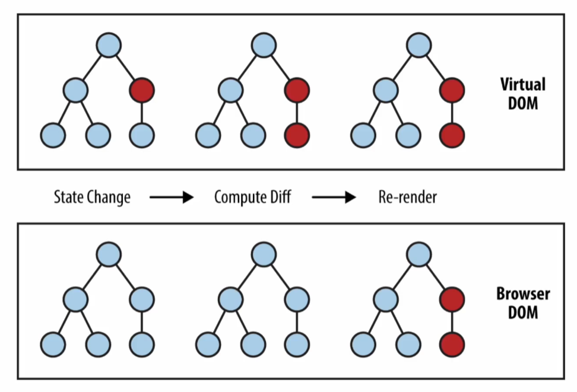
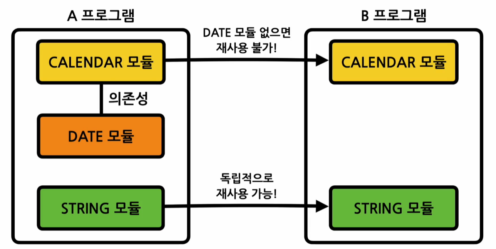

# 색션 1 리액트 소개
## 리액트는 무엇인가?
### 라이브러리? 
- 자주 사용되는 기능들을 정리해 모아둔 것
### 사용자 인터페이스(User Interface, UI)
- 사용자가 입력하는 것들 모든 것, 그리고 이러한 것들을 모아 둔 것이 UI 라이브러리 
- react는 이러한 사용자 인터페이스의 컴포넌트들의 모음이다. 
- 화면을 그리는 대표적인 UI 라이브러리들은 다음과 같다. 
  - 앵귤러(구글) 프레임워크 : 구글에서 시작 되었으나, 이젠 지원 끊김
  - 리액트(페이스북, 메타) : 2013년 처음 출시, 가장 많이 사용되는 라이브러리
  - Vue.js 프레임워크 : 중국인 개발자로부터 시작한 오픈소스 프로젝트, 영향력이 커져 이제는 리액트와 함께 거론되는 대형 라이브러리가 됨.
### 프레임워크 vs 라이브러리
- 프로그램의 흐름에 대한 제어 권한이 개발자에게 있으면 라이브러리, 프로그램에게 있다면 프레임워크이다.

### 웹 개발의 트렌드 
- 한 가지 기술이 평생 대세가 되는 구조는 아니므로, 다양하게 접근하고 관심을 가질 필요가 있다. 
- 현 대세는 리액트이긴 하다. 웹 개발의 표준처럼 여겨지고 있다. 
- 해당 강의의 핵심은 리액트이긴 하지만, 동시에 웹 사이트의 동작 원리를 이해하는 것이 중요하기도 하다. 

## 리액트의 장점과 단점
### 리액트의 장점 
- 빠른 업데이트 & 렌더링 속도 (Virtual DOM) 
  - DOM 은 웹 사이트의 정보를 담고 있는 객체 덩어리. 
  - 이때 Virtual DOM은 가상의 돔으로, 실제 돔의 앞에서 빠르게 반응할 수 있도록 만드는 역할을 함. 
    
  - 기존의 시스템은 DOM 자체를 직접 수정하는 방법으로, 돔의 내부 노드를 탐색해야하고, 수정하니 리소스도 많이 잡아 먹으며 효과적이지 못함. 
- Component-Based : 모든 페이지가 컴포넌트로, 작은 컴포넌트들의 조합으로 구성되어 있다. 이러한 구조 덕분에 구성이 용이하고, 재사용성(Reusability)을 끌어 올려준다. 
    
  - 다른 모듈의 의존성이 낮아져서, 어디서든 붙여서 사용이 가능하도록 만들수 있다.
  - 개발 기간이 단축시키며, 유지보수가 용이해짐 
- 리액트와 재사용성
### 리액트의 단점 
- Running curve : Virtual DOM, JSX, Component, State, Props 등 배워야할 개념이 너무 생소하고 배워야함
- 계속 뭔가 바뀌고 있어서 꾸준이 배워야 한다. : 새로운 것을 계속 공부해야함 
- 높은 상태 관리 복잡도 : state 는 성능과 바뀌는 모양 등을 위하여 굉장히 중요하다. 상태 관리의 기본 개념을 확실히 이해하려고 노력할 것

# 색션 2 리액트 시작하기
## [실습] 직접 리액트 연동하기 
### HTML 만으로 간단한 웹 사이트 만들기
### CSS를 사용하여 웹 사이트 스타일링 하기
### 웹 사이트에 React.js 추가하기
- 전체 과정을 통해 알 수 있는 것은 하나하나 이렇게 준비한다면 겁나 힘들 것이다..!  

## [실습] create-react-app
### create-react-app(CRA)
- 하나씩 천천히 다 만드는게 아니라, 리액트 애플리케이션 구축을 위해 기본적인 설정, 파일들을 일괄로 처리하는 방식
- 이를 구현하기 위해선 Node, npm, IDE가 있으면 된다.
  ```shell
   $ npx create-react-app <your-project-name>
  ```
